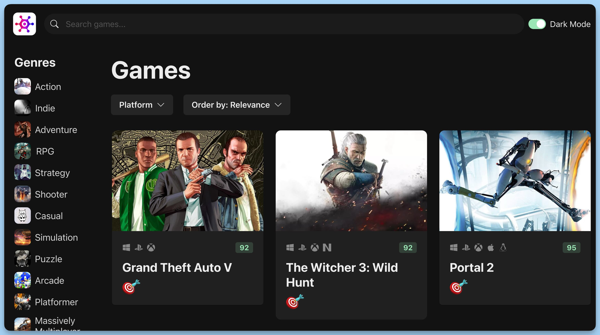

## 📦 Application - GameHub

### 🚀 Review
The code represents the main component of the "Game Search" application, developed using the React library and the Chakra UI framework to build the user interface.

### Imports

The source code begins with importing the necessary dependencies, components, and interfaces.

### Interface `GameQuery`

An interface named GameQuery has been created to define the structure of a game search query. It includes the following properties:

- genre (Game genre, can be null).
- platform (Game platform, can be null).
- sortOrder (Sort order for search results).
- searchText (Search text for games).

### Main component `App`

The main part of the "Game Search" app. It's made up of these key pieces:

- A gameQuery state that reflects the current game search query.
- A Grid layout defined using Chakra UI to organize the page layout.

### Navigation Bar `NavBar`

The NavBar component represents the application's navigation bar. It includes a logo, a search bar, and a theme toggle.

### List of Genres `GenreList`

The GenreList component allows for selecting game genres to filter search results.

### Title `GameHeading`

The GameHeading component displays information about the current search query, including the selected game genre and platform.

### Platform Selector `PlatformSelector`

The `PlatformSelector` allows for selecting a platform to filter search results.

### Sort Selector `SortSelector`

The `SortSelector` provides options for sorting search results by various parameters.

### Game Grid `GameGrid`

The `GameGrid` component displays a grid of games based on the current search query.

### Export `App`

The code concludes with the export of the App component, which will be used to render the application's main page.

---
#### 🌄 Preview:

